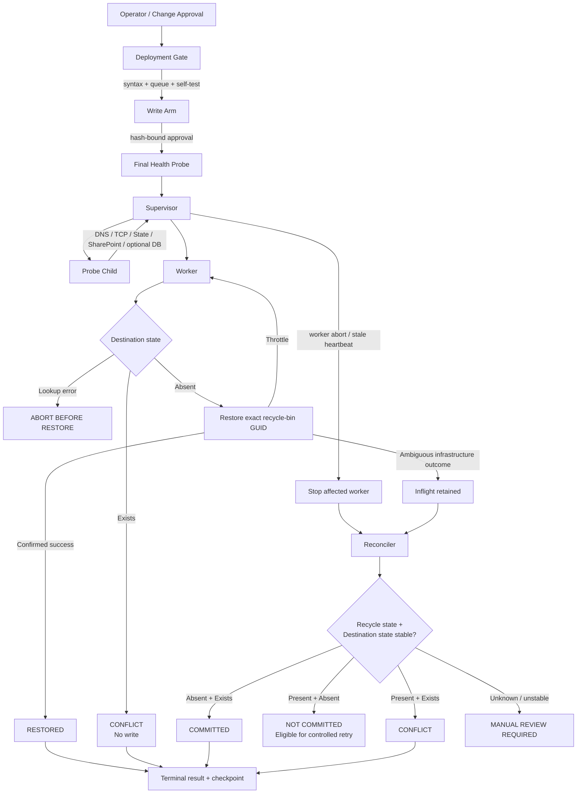

# M365 RecoveryGuard

**M365 RecoveryGuard** is a safety-first PowerShell reference framework for investigating and recovering large Microsoft 365 / SharePoint deletion incidents.

It is built around a simple operational rule:

> **Do not turn an uncertain restore into a second incident.**

RecoveryGuard separates detection, validation, recovery, reconciliation, monitoring, and evidence handling. It uses immutable recycle-bin object identity, pre-write destination checks, a hash-bound write-authorization envelope, durable state, Supervisor/Worker isolation, health probes, watchdog recovery, and fail-closed handling of ambiguous outcomes.

> [!IMPORTANT]
> This repository is a **sanitized reference implementation**, not a Microsoft-supported recovery product. It contains synthetic examples only and is intentionally separated from real customer data, production queues, audit exports, incident evidence, tenant identifiers, credentials, and operational reports.

## Why RecoveryGuard exists

Large deletion incidents are not safely handled by “restore everything and retry whatever errors.”

A recovery process can encounter several materially different conditions:

- an object is still in the recycle bin and its destination is absent;
- an object has already been restored;
- another object now occupies the original destination;
- infrastructure fails after a restore request is submitted;
- a worker stalls while an operation may already have committed;
- local/endpoint deletion telemetry does not represent a confirmed cloud-side deletion.

RecoveryGuard treats those as different states and makes **reconciliation** a first-class operation instead of assuming that an exception means “not restored.”

## Core design principles

| Principle | RecoveryGuard behavior |
| --- | --- |
| **Immutable identity** | Restore operations target the recycle-bin GUID rather than relying on filename-only matching. |
| **Fail closed** | Recovery writes require an explicit write gate plus a matching approval envelope. |
| **No overwrite** | If the original destination is already occupied, the item is classified as a conflict and is not automatically displaced. |
| **Pre-write certainty** | An unhealthy/failed destination lookup aborts before the restore call. |
| **Ambiguous != failed** | Post-invocation uncertainty is reconciled from recycle-bin state and destination state before any retry. |
| **Durable progress** | Inflight state, heartbeat, terminal result, and checkpoint data are persisted separately. |
| **Process isolation** | The Supervisor owns lifecycle and health policy; the Worker processes queue items. |
| **Infrastructure awareness** | DNS, TCP 443, SharePoint access, state-store I/O, and optional database connectivity are probed independently. |
| **Bounded recovery** | Queue and engine SHA-256 values, queue metadata, site, client ID, program version, and incident population are bound into the local arm envelope. |
| **Read-only observability** | Monitoring reads state and results without controlling recovery execution. |
| **Evidence discipline** | Runtime evidence and real incident artifacts are excluded from source control by default. |

## Architecture



The detailed design, state model, validation matrix, limitations, and threat/failure analysis are documented in the **[Technical Architecture & Validation Report](docs/technical-architecture-and-validation.md)**.

## Repository layout

```text
M365-RecoveryGuard/
├── README.md
├── .gitignore
├── NOTICE.md
├── SECURITY.md
├── PACKAGE-SHA256.txt
├── REPOSITORY-STRUCTURE.txt
├── config/
│   └── recovery.template.json
├── docs/
│   ├── architecture.md
│   ├── case-study.md
│   ├── github-first-upload.md
│   ├── safety-model.md
│   ├── sanitization.md
│   └── technical-architecture-and-validation.md
├── examples/
│   └── queue.synthetic.csv
├── src/
│   ├── M365-Recovery-SelfHealing.ps1
│   ├── Start-RecoveryGuard.ps1
│   └── Watch-RecoveryGuard.ps1
├── tests/
│   ├── Invoke-Tests.ps1
│   ├── README.md
│   └── RecoveryGuard.Repository.Tests.ps1
└── tools/
    ├── Export-RecoveryEvidence.ps1
    └── Test-RepositorySanitization.ps1
```

## Control-plane components

### `src/M365-Recovery-SelfHealing.ps1`

The engine supports discrete operating modes for:

- `Supervisor`
- `Worker`
- `Probe`
- `Reconcile`
- `Report`
- `SelfTest`
- `SelfTestWorker`
- `ArmCheck`

The Worker handles one queue item at a time. The Supervisor owns process lifecycle, probes, pause/resume policy, hang detection, and reconciliation after uncertain stops.

### `src/Start-RecoveryGuard.ps1`

The launcher is the deployment gate. Before transferring control to a Supervisor it:

1. requires a local config and engine;
2. rejects an already-active Supervisor;
3. rejects unexplained inflight state;
4. rejects an already-advanced checkpoint for a fresh launch;
5. forces the write gate closed;
6. validates PowerShell syntax;
7. fingerprints the reviewed queue and engine;
8. runs the runtime self-test;
9. creates the local arm envelope;
10. performs an `ArmCheck`;
11. requires a healthy final probe; and
12. proves the Supervisor successfully initialized.

Any startup verification failure resets the write gate closed.

### `src/Watch-RecoveryGuard.ps1`

The monitor is read-only. It reports checkpoint progress, terminal results, process liveness, heartbeat age, health state, and the latest event while tolerating transient read/file-lock errors.

## Safety envelope

RecoveryGuard does not rely on `WriteEnabled = true` by itself.

The engine also validates a local arm file and compares its approved values against the current environment, including:

- engine SHA-256;
- queue SHA-256;
- queue count;
- first/last sequence;
- first recycle-bin GUID;
- SharePoint site;
- program version;
- Entra client ID; and
- configured incident population.

This is a **hash-bound local approval mechanism**, not a digital signature or hardware-backed attestation. See the technical report for its security boundary and limitations.

## Quick start

### Requirements

- PowerShell 7.4+
- PnP.PowerShell appropriate to the target environment
- authorized Microsoft 365 / SharePoint access
- Pester 5+ for repository validation (validated with Pester 6.1.0)

### 1. Create a local configuration

Copy:

```text
config/recovery.template.json
```

to:

```text
config/recovery.local.json
```

Do not commit the local file. The repository `.gitignore` excludes it.

Populate your own:

- SharePoint site;
- authentication settings;
- queue path;
- state directory;
- recovery/supervisor parameters; and
- reporting baselines.

The template intentionally defaults to:

```json
"WriteEnabled": false
```

### 2. Validate the repository

Install Pester if required:

```powershell
Install-PSResource Pester -Scope CurrentUser -TrustRepository
```

Run the offline validation suite:

```powershell
pwsh `
    -NoProfile `
    -ExecutionPolicy Bypass `
    -File ".\tests\Invoke-Tests.ps1"
```

### 3. Run the sanitization scanner

Before any external publication or repository visibility change:

```powershell
pwsh `
    -NoProfile `
    -ExecutionPolicy Bypass `
    -File ".\tools\Test-RepositorySanitization.ps1"
```

Add organization-specific prohibited terms to your **local** scanner review before public release.

### 4. Validate in a non-production environment

Do not enable recovery writes merely because the scripts parse or the offline tests pass.

Before production use, independently validate:

- authentication and least privilege;
- recycle-bin permissions;
- queue provenance and uniqueness;
- original destination derivation;
- no-overwrite expectations;
- state-store reliability;
- throttling behavior;
- health probe behavior;
- reconciliation logic; and
- operational authorization/change controls.

## Validation status

Current repository validation baseline:

**35 / 35 offline Pester 6.1.0 tests passed.**

| Test group | Tests | Result |
| --- | ---: | --- |
| Repository structure | 2 | PASS |
| PowerShell syntax | 4 | PASS |
| Configuration safety defaults | 5 | PASS |
| Synthetic queue integrity | 5 | PASS |
| Fail-closed source controls | 11 | PASS |
| `.gitignore` protections | 4 | PASS |
| Sanitization scanner integration | 4 | PASS |
| **Total** | **35** | **PASS** |

The suite validates repository and source-level safety invariants. It **does not constitute live SharePoint integration testing**, end-to-end tenant validation, penetration testing, or formal verification.

See **[Technical Architecture & Validation Report](docs/technical-architecture-and-validation.md#validation)** for the exact interpretation of this result.

## Current limitations

RecoveryGuard is intentionally conservative and is still a reference framework.

Current limitations include:

- no Microsoft product support or certification;
- no automated live-tenant integration test suite;
- several Pester controls are source/invariant checks rather than mocked behavioral tests;
- local JSON/CSV filesystem state is not a transactional distributed state store;
- the arm envelope is hash-bound but not digitally signed;
- interactive persisted authentication is available for operator-driven scenarios;
- certificate-thumbprint authentication depends on local certificate management;
- no automated overwrite/rename/displacement of conflicting destination objects;
- ambiguous states deliberately escalate to manual review;
- GitHub Actions/CI is not assumed until a workflow is explicitly added;
- no open-source license has been granted yet.

## Documentation

- **[Technical Architecture & Validation Report](docs/technical-architecture-and-validation.md)** — canonical engineering report
- [Architecture](docs/architecture.md) — concise component overview
- [Safety Model](docs/safety-model.md) — fail-closed operational boundaries
- [Sanitization](docs/sanitization.md) — pre-publication checklist
- [Sanitized Case Study](docs/case-study.md) — generalized recovery lessons
- [Security Policy](SECURITY.md) — responsible handling guidance

## Security and responsible use

Recovery operations can alter production data. Use RecoveryGuard only in environments where you have explicit authorization and have independently validated the recovery population.

Never commit:

- production queues or manifests;
- audit exports;
- customer or user identifiers;
- tenant-specific URLs;
- recycle-bin GUIDs from real incidents;
- runtime state or logs;
- credentials, tokens, certificates, or connection strings; or
- real incident reports/evidence packages.

If sensitive information is ever committed, deleting it from the latest working tree is not sufficient; Git history must be treated as exposed and remediated accordingly.

## Project status

**Reference implementation / engineering portfolio project.**

The repository demonstrates a recovery-control architecture and its safety model. It should be adapted, tested, and formally authorized for each target environment.

## License

No open-source license is included at this time. See [`NOTICE.md`](NOTICE.md).
