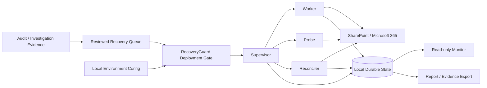
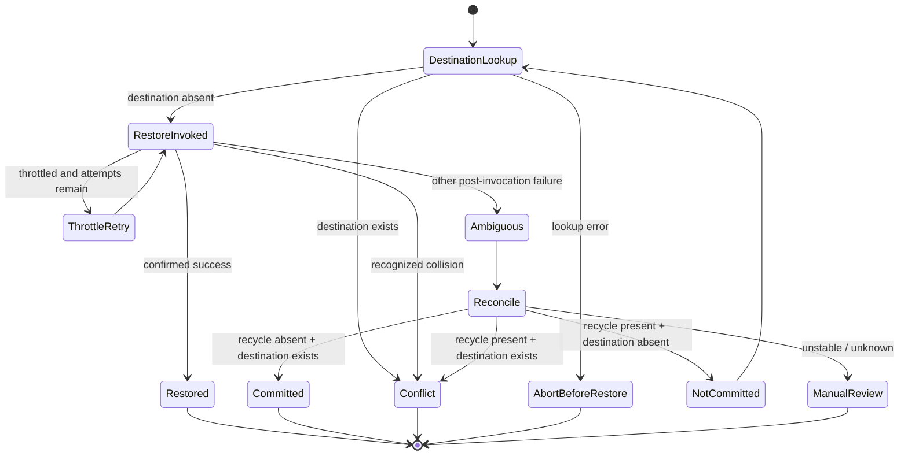

# M365 RecoveryGuard
## Technical Architecture & Validation Report

**Document role:** Canonical engineering description of the sanitized RecoveryGuard reference framework  
**Validation baseline:** 35/35 offline Pester 6.1.0 tests passed  
**Production-data policy:** Synthetic/reference content only; real incident evidence is intentionally excluded

---

## 1. Executive technical summary

M365 RecoveryGuard is a PowerShell-based orchestration framework for controlled recovery of Microsoft 365 / SharePoint recycle-bin objects after large deletion incidents.

The framework is designed around the failure modes that make bulk recovery dangerous:

- the destination may already be occupied;
- a restore request may commit even if the client receives an exception;
- network/authentication/state-store failures can be confused with object-level failures;
- a worker can stall after a write was submitted;
- retrying an uncertain write can create conflict, duplication, or a misleading recovery record;
- local endpoint deletion telemetry does not by itself prove a SharePoint cloud deletion.

RecoveryGuard addresses those conditions by separating orchestration into **deployment gating, Supervisor lifecycle control, single-item Worker execution, health probing, exact reconciliation, monitoring, and evidence/reporting**.

The framework is deliberately fail-closed. An ambiguous state is not automatically converted into a retry.

---

## 2. Design objectives

RecoveryGuard has seven primary engineering objectives.

### 2.1 Restore by immutable object identity

The Worker derives the recycle-bin object identifier from the queue and invokes:

```powershell
Restore-PnPRecycleBinItem -Identity <RecycleBinGuid>
```

This avoids treating filename or display name as the authoritative identity of a deleted object.

### 2.2 Never overwrite an occupied destination automatically

Before submitting a restore, the Worker performs a strict destination lookup.

If the destination exists, the result is recorded as `CONFLICT`, the checkpoint advances, and no restore call is made for that item.

If the destination lookup itself fails, the Worker exits before the restore call rather than interpreting a lookup failure as “destination absent.”

### 2.3 Distinguish an exception from a failed write

Once a restore has been invoked, an infrastructure exception is not sufficient evidence that the restore did not commit.

RecoveryGuard persists inflight state and requires reconciliation of:

1. recycle-bin state; and
2. destination state.

Only then can the Supervisor decide whether the operation committed, did not commit, conflicted, or requires human review.

### 2.4 Make recovery progress durable

The framework maintains distinct state artifacts for:

- checkpoint;
- heartbeat;
- inflight operation;
- terminal results;
- health history;
- event history;
- probe output;
- reconciliation output;
- Supervisor/Worker PID state; and
- self-test output.

This separation makes process death less likely to erase the facts needed to decide the next safe action.

### 2.5 Isolate lifecycle control from object execution

The Supervisor owns policy and process lifecycle. The Worker performs item-level execution.

This allows a stalled Worker to be terminated and reconciled without treating the entire orchestration process as disposable.

### 2.6 Bind writes to a reviewed execution envelope

The launcher calculates SHA-256 values and queue metadata, runs a self-test, creates a local arm record, and then enables writes only after `ArmCheck` and a final health probe pass.

The engine validates the envelope again before Worker/Supervisor writes.

### 2.7 Preserve a clean evidence and source-control boundary

The repository is sanitized and synthetic. Runtime state, customer evidence, manifests, production queues, credentials, certificates, and incident reports are excluded from version control by default.

---

## 3. System context

RecoveryGuard sits between an operator-approved recovery population and SharePoint recycle-bin restore operations.



The framework does not attempt to replace forensic investigation. A recovery queue is expected to have been independently derived and reviewed before writes are armed.

---

## 4. Component architecture

### 4.1 Deployment gate — `Start-RecoveryGuard.ps1`

The launcher performs preflight and transfer-of-control checks.

Its sequence is:

```text
Require local config + engine
        |
Reject active Supervisor
        |
Reject unexplained inflight state
        |
Reject advanced checkpoint for fresh launch
        |
Force WriteEnabled = false
        |
Parse engine syntax
        |
Load and validate non-empty queue
        |
Calculate engine + queue SHA-256
        |
Bind queue metadata into local config
        |
Run engine SelfTest
        |
Create local arm envelope
        |
Set WriteEnabled = true
        |
ArmCheck
        |
Final health Probe
        |
Start Supervisor
        |
Verify Supervisor PID + SUPERVISOR_START event
        |
Transfer control
```

If `ArmCheck`, the final probe, or Supervisor startup verification fails, the launcher resets the write gate closed.

### 4.2 Supervisor

The Supervisor is the orchestration control plane.

Responsibilities include:

- claiming a mutex derived from the state directory;
- writing Supervisor PID state;
- validating the write arm/safety envelope;
- running an initial health probe;
- launching/relaunching Workers;
- maintaining pause/resume behavior when health becomes unstable;
- checking heartbeat age;
- detecting a hung Worker;
- terminating only the affected Worker;
- reconciling inflight work before retry/continuation;
- refusing unresolved/manual-review reconciliation; and
- cleaning PID ownership on exit.

The Supervisor does not make destination-overwrite decisions by itself. It coordinates the Worker and Reconciler.

### 4.3 Worker

The Worker processes one queue item at a time.

For each item it:

1. derives immutable recycle-bin GUID and destination;
2. writes inflight + heartbeat state for destination lookup;
3. performs the strict destination lookup;
4. records `CONFLICT` with no restore when the destination is occupied;
5. records an abort-before-restore condition when the lookup fails;
6. marks the inflight record as restore-invoked;
7. invokes the exact recycle-bin GUID;
8. writes a terminal result and checkpoint on confirmed success;
9. handles recognized destination-collision responses as conflict;
10. applies bounded exponential backoff for throttling; and
11. exits with inflight state preserved for ambiguous post-invocation failures.

This ordering is important: inflight state is written **before** the potentially ambiguous operation.

### 4.4 Probe

The Probe separates dependency health from object state.

Current checks include:

| Dependency | Check |
| --- | --- |
| DNS | Resolve target SharePoint hostname |
| Network | TCP 443 |
| State store | Write/read/delete probe file |
| SharePoint | Authenticate/connect and confirm site |
| Database | Optional `SELECT 1` when enabled |

Probe execution is bounded by a configurable timeout when run as a child process.

### 4.5 Reconciler

The Reconciler independently examines the inflight object after an uncertain stop.

It performs two observations of:

- recycle-bin state; and
- destination state.

The observations must be stable before an automatic classification is trusted.

Conceptual classification:

| Recycle bin | Destination | Classification | Automatic action |
| --- | --- | --- | --- |
| Absent | Exists | `COMMITTED` | Record committed recovery and checkpoint |
| Present | Absent | `NOT_COMMITTED` | Clear inflight; controlled retry may proceed |
| Present | Exists | `CONFLICT` | Record conflict and checkpoint |
| Unknown/unstable | Any | `MANUAL_REVIEW_REQUIRED` | Stop automatic recovery |

This prevents “exception = retry” behavior.

### 4.6 Monitor

`Watch-RecoveryGuard.ps1` is read-only.

It displays:

- checkpoint and completion percentage;
- pending count;
- restored/conflict/failure counts;
- last sequence/result;
- Supervisor/Worker PIDs and liveness;
- heartbeat phase and age;
- latest health result; and
- latest event.

Transient read errors are reported as monitor warnings and do not affect the Supervisor.

### 4.7 Evidence/export tooling

`Export-RecoveryEvidence.ps1` is intended to package local recovery evidence separately from the source repository.

The source repository `.gitignore` excludes common runtime and incident artifacts, including state, logs, manifests, audit files, report formats, certificate material, and non-synthetic queues.

---

## 5. Recovery state model

At the item level, the important state transition is not simply `PENDING -> RESTORED`.



The distinction between **pre-invocation** and **post-invocation** failure is a core safety boundary.

---

## 6. Hash-bound write authorization

### 6.1 Queue safety checks

`Assert-QueueSafety` validates the reviewed queue against expected metadata:

- non-empty queue;
- queue count;
- first sequence;
- last sequence;
- first recycle-bin GUID; and
- optional configured queue SHA-256.

### 6.2 Engine integrity

The running engine calculates its own SHA-256 through `Get-EngineHash`.

If `ExpectedEngineSha256` is configured, the current engine must match it.

### 6.3 Arm validation

`Assert-WriteArmed` requires both:

```text
Safety.WriteEnabled = true
```

and a valid approved arm file.

The arm is compared against the current runtime context for:

- valid arm GUID;
- approval timestamp;
- engine SHA-256;
- queue SHA-256;
- queue count;
- first/last sequence;
- first GUID;
- SharePoint site;
- program version;
- client ID; and
- incident population.

### 6.4 Security boundary

The arm mechanism is best described as a **hash-bound local approval envelope**.

It provides useful protection against:

- accidentally launching a different queue;
- editing the engine after approval;
- changing the target site;
- changing key queue boundaries;
- reusing an envelope against a mismatched configuration.

It does **not** provide:

- a digital signature;
- hardware-backed attestation;
- protection from a local administrator intentionally modifying both config and arm;
- centralized multi-party approval;
- non-repudiation.

Those are roadmap opportunities for a hardened enterprise implementation.

---

## 7. Collision and overwrite safety

RecoveryGuard treats an occupied destination as a protected outcome, not as an obstacle to remove.

Automatic behavior does not:

- delete the existing destination;
- rename the existing destination;
- overwrite it;
- move it elsewhere; or
- choose which copy is authoritative.

The item is terminally classified as `CONFLICT` and left for a separate review process.

This prevents recovery logic from destroying content that may have been recreated after the deletion event.

---

## 8. Infrastructure failure handling

Recovery operations depend on infrastructure outside the object being restored.

RecoveryGuard explicitly models:

- DNS failure;
- TCP/network failure;
- SharePoint authentication/access failure;
- state-store failure;
- optional database failure;
- child-process timeout;
- throttling;
- stale Worker heartbeat; and
- post-restore ambiguity.

### 8.1 Throttling

The Worker recognizes throttling conditions and uses bounded exponential delay controlled by:

- `MaxThrottleAttempts`
- `ThrottleBaseDelaySeconds`

Exhausted/other post-invocation errors are not silently converted into retries.

### 8.2 Health pause behavior

The Supervisor can create a pause flag after health deterioration.

The Worker checks the pause flag between items, allowing the orchestration to stop at an item boundary rather than continuing writes through known unhealthy conditions.

The Supervisor requires configured consecutive healthy probes before clearing the pause.

### 8.3 Hang detection

Heartbeat age is compared against an adaptive timeout.

`Get-HangTimeout` uses recent terminal-result duration data when sufficient history exists and scales the observed p95 duration within configured minimum/maximum bounds.

If a Worker exceeds the timeout:

1. the Supervisor records `HANG_DETECTED`;
2. stops the affected Worker;
3. preserves/reads inflight state;
4. waits for healthy probe state; and
5. reconciles before continuation.

---

## 9. Durable state and idempotency

RecoveryGuard uses local atomic JSON replacement for key state documents.

Important artifacts include:

| Artifact | Purpose |
| --- | --- |
| `checkpoint.json` | Next queue index and last terminal result |
| `inflight.json` | Current item, destination, phase, whether restore was invoked |
| `worker-heartbeat.json` | Worker liveness and phase |
| terminal results CSV | Durable per-item outcomes |
| events JSONL | Orchestration/audit events |
| health CSV | Dependency health history |
| `probe-result.json` | Latest child probe outcome |
| `reconcile-result.json` | Latest reconciliation classification |
| `supervisor.pid` | Supervisor ownership/liveness |
| `worker.pid` | Worker process tracking |
| `selftest-result.json` | Runtime self-test output |

The framework's idempotency strategy is primarily based on:

- immutable recycle-bin identity;
- destination-state validation;
- durable checkpointing; and
- exact reconciliation before retry.

It is not based on blindly re-submitting the same command after an exception.

---

## 10. Runtime self-test

Before the deployment gate creates the final write arm, the engine self-test checks runtime properties including:

- queue safety;
- state-store read/write;
- three sequential health probes;
- detection of an intentionally hung child;
- termination of that hung child;
- atomic checkpoint behavior;
- expected PID-path schema;
- engine hash readability/match; and
- write gate closed by default.

The self-test is separate from the repository Pester suite.

This distinction matters:

- **Pester** validates the sanitized repository and source-level invariants offline.
- **SelfTest** validates selected runtime behavior in the configured environment before arming.

---

## 11. Authentication model

The reference configuration currently supports:

### Interactive persisted authentication

```text
Authentication.Mode = InteractivePersisted
```

This uses PnP interactive authentication with persisted login state and is suitable for operator-driven/reference scenarios.

### Certificate thumbprint authentication

```text
Authentication.Mode = CertificateThumbprint
```

This uses tenant, client ID, and a certificate thumbprint.

### Authentication roadmap

For enterprise/hosted operation, stronger patterns should be evaluated, such as:

- certificate-backed workload identity with formal key lifecycle;
- managed identity where supported;
- tenant-specific least-privilege app registrations;
- centralized secret/certificate management;
- just-in-time authorization; and
- auditable approval workflows.

The framework does not claim that the current sample authentication model is sufficient for every production environment.

---

## 12. Configuration model

The sanitized template includes the following major sections:

- `ProgramVersion`
- `SharePoint`
- `Authentication`
- `Target`
- `Paths`
- `Recovery`
- `Supervisor`
- `Health`
- `Reporting`
- `Safety`

The template uses placeholder values such as:

```text
https://tenant.sharepoint.com/sites/TargetSite
affected-user@example.com
<ENTRA_APP_CLIENT_ID>
```

and defaults the write gate closed.

Local operational configuration belongs in `config/recovery.local.json`, which is excluded from Git.

---

## 13. Repository sanitization model

The repository scanner performs fail-closed checks for common publication risks.

Current categories include:

- locally configured blocked literal terms;
- private-key markers;
- common secret assignment patterns;
- non-example email domains;
- non-placeholder SharePoint tenant URLs;
- Windows user-profile paths that may disclose operator names; and
- credential/certificate file types.

The scanner is a **publication guardrail**, not a complete data-loss-prevention product.

Before changing repository visibility or publishing a release, an operator should add actual organization/customer/private-domain terms to the local blocked-term review and manually inspect Git history.

---

# Validation

## 14. Validation methodology

The current automated repository suite uses **Pester 6.1.0** and contains **35 offline tests**.

The suite intentionally avoids connecting to SharePoint and does not submit recovery writes.

The result observed for the current sanitized baseline is:

```text
Tests Passed: 35
Tests Failed: 0
Skipped: 0
Inconclusive: 0
NotRun: 0
```

### 14.1 Validation matrix

| Group | Count | What is validated |
| --- | ---: | --- |
| Repository structure | 2 | Expected core files exist; no committed local production config |
| PowerShell source validation | 4 | Engine, launcher, monitor, and sanitizer parse without syntax errors |
| Configuration safety defaults | 5 | Valid JSON, write gate closed, placeholder site/account/client ID |
| Synthetic recovery queue | 5 | Non-empty, valid GUIDs, unique GUIDs/sequences, sanitized target paths |
| Fail-closed source controls | 11 | Immutable GUID restore, destination checks, arm gate, hash checks, watchdog, reconciliation, launcher safeguards |
| `.gitignore` protection | 4 | Local config, state, key material, and incident-report formats excluded |
| Sanitization integration | 4 | Current repo passes; safe placeholders allowed; unsafe tenant/user-path fixtures rejected |
| **Total** | **35** | **35 passed** |

## 15. What the 35/35 result proves

The test result supports the following statements about the validated repository snapshot:

- core sanitized files are present;
- core PowerShell files parse;
- the template defaults the write gate closed;
- the template contains sanitized placeholder identity/tenant values;
- the synthetic queue has valid, unique object identifiers and sequence values;
- source code contains the intended fail-closed controls;
- Git ignore rules cover key classes of production/sensitive artifacts;
- the sanitization scanner accepts intended placeholders; and
- the sanitization scanner rejects selected unsafe fixture patterns.

## 16. What the 35/35 result does **not** prove

The result must not be represented as:

- a successful live SharePoint recovery test;
- proof that PnP permissions are correctly scoped in a real tenant;
- proof of end-to-end recovery correctness under every Microsoft 365 response;
- a penetration test;
- a security certification;
- formal verification;
- Microsoft support/certification;
- proof that every possible secret/identifier pattern is detected; or
- proof that all collision/reconciliation branches have been behaviorally mocked.

Several current tests are **source/invariant assertions**. They confirm that controls are represented in the implementation, but they are not a substitute for behavioral tests around mocked PnP operations.

---

## 17. Recommended next validation layer

The next major engineering step is to extract pure decision logic into a module such as:

```text
src/RecoveryGuard.Core.psm1
```

Then Pester can mock SharePoint operations and assert behavior rather than only source presence.

High-value behavioral tests include:

### Destination conflict

Given a destination exists:

```text
Expected classification: CONFLICT
Expected Restore-PnPRecycleBinItem calls: 0
```

### Destination lookup failure

Given `Get-PnPFile` fails:

```text
Expected: abort before restore
Expected restore calls: 0
Expected inflight phase: destination lookup
```

### Queue hash mismatch

Given the reviewed queue changes after arming:

```text
Expected: write gate closed
Expected Worker launch: 0
```

### Engine hash mismatch

Given the engine changes after the approval envelope is created:

```text
Expected: ArmCheck failure
Expected: write gate closed
```

### Ambiguous post-invocation exception

Given the restore call may have committed but returns an infrastructure exception:

```text
Expected: inflight retained
Expected: reconciliation required
Expected: no blind immediate retry
```

### Reconciliation — committed

Given:

```text
recycle object = absent
destination = exists
stable across reads
```

Expected:

```text
classification = COMMITTED
checkpoint advances
```

### Reconciliation — not committed

Given:

```text
recycle object = present
destination = absent
stable across reads
```

Expected:

```text
classification = NOT_COMMITTED
inflight cleared
controlled retry may proceed
```

### Supervisor exclusivity

Given an active Supervisor owns the state directory:

```text
Expected: second launch refused
```

These tests would materially strengthen the evidence that RecoveryGuard enforces its safety model dynamically.

---

## 18. Threat and failure model

| Threat / failure | Current control | Residual risk |
| --- | --- | --- |
| Wrong recovery queue | SHA-256 + count/sequence/GUID envelope | Privileged local actor can intentionally re-arm altered inputs |
| Modified engine | Engine SHA-256 comparison | Local approval envelope is not digitally signed |
| Wrong SharePoint site | Arm/config site comparison + connection verification | Incorrect site could still be intentionally approved |
| Duplicate/incorrect queue identity | Synthetic validation + immutable GUID model | Real queue provenance requires external forensic review |
| Existing destination | Pre-write lookup + conflict classification | Destination may change between check and write (TOCTOU) |
| Destination lookup outage | Abort before restore | Requires healthy retry/review later |
| Restore commits but client errors | Inflight + exact reconciliation | Reconciliation depends on observable recycle/destination state |
| Worker hangs | Heartbeat + adaptive timeout + kill/reconcile | Timeout tuning may require environment-specific calibration |
| Dependency outage | Independent health probe + pause/backoff | Long outages require operator oversight |
| State-store corruption/unavailability | atomic writes + state-store probe | Local filesystem is not transactional/distributed storage |
| Concurrent Supervisor | mutex + PID controls | Host/process/permission edge cases still require testing |
| Secret/customer data committed | `.gitignore` + sanitizer + manual review | Git history and novel data patterns remain operator responsibility |
| Privileged local tampering | Hash-bound envelope | No signed/non-repudiable approval boundary |

### 18.1 Time-of-check/time-of-use

The destination check occurs before the restore invocation. Another process could theoretically create the destination after the check but before the restore completes.

RecoveryGuard also handles recognized restore-time collision errors as `CONFLICT`, but a hardened future design should include explicit behavioral tests for this race.

---

## 19. Operational safety requirements

Before adapting RecoveryGuard to a production tenant:

1. establish explicit authorization and change control;
2. confirm the recovery population from independent evidence;
3. deduplicate by immutable recycle-bin identity;
4. validate required permissions and least privilege;
5. validate the target site and original destination mapping;
6. test in a non-production environment;
7. verify state storage is reliable and not unexpectedly synchronized/locked;
8. run the repository validation suite;
9. run the sanitization scan for source-control changes;
10. run the runtime self-test;
11. review the generated queue/engine fingerprints before arming;
12. maintain a separate manual process for conflicts and unresolved items; and
13. retain recovery evidence independently of the Git repository.

---

## 20. Known limitations

The current reference implementation has deliberate and technical limitations.

### 20.1 Validation coverage

The 35-test suite is offline and primarily validates repository structure and source-level invariants.

Behavioral mocking of PnP operations is the next priority.

### 20.2 State store

The reference architecture uses local filesystem JSON/CSV state.

For a multi-host or SaaS/MSP implementation, use a transactional state store with:

- concurrency control;
- durable transactions;
- idempotency keys;
- audit history;
- lease/ownership semantics; and
- structured telemetry.

### 20.3 Approval envelope

The arm file binds hashes and execution metadata, but it is locally writable and not digitally signed.

A hardened implementation should consider:

- signed approvals;
- centralized policy;
- multi-party authorization;
- immutable audit storage; and
- workload identity attestation.

### 20.4 Authentication

Interactive persisted login is not a desirable unattended service architecture.

Certificate-thumbprint mode shifts risk to certificate lifecycle and local key protection.

### 20.5 Recovery scope

RecoveryGuard is not a general-purpose SharePoint rollback engine. It is oriented around reviewed recycle-bin objects and safe restoration decisions.

### 20.6 Conflicts

Conflict handling intentionally stops at classification. Automated content merge, rename, overwrite, or displacement is outside the current safety boundary.

### 20.7 Monitoring

The monitor is local/read-only and does not provide centralized alerting, distributed tracing, or long-term analytics.

### 20.8 CI/CD

The repository has a local Pester suite. A GitHub Actions workflow should only be claimed once one is explicitly added and validated.

### 20.9 License

No open-source license is currently granted. Publication and reuse rights must be resolved separately from technical sanitization.

---

## 21. Engineering roadmap

### Phase 1 — behavioral testability

- extract `RecoveryGuard.Core.psm1`;
- isolate pure classification functions;
- mock PnP calls;
- test zero-write conflict/lookup-error branches;
- test every reconciliation combination;
- test hash mismatch behavior.

### Phase 2 — continuous validation

- add GitHub Actions;
- run PowerShell parser validation;
- run Pester;
- run repository sanitization;
- publish test results as build artifacts;
- add a validation badge only after CI is proven stable.

### Phase 3 — identity and authorization hardening

- certificate/workload identity;
- least-privilege tenant authorization;
- signed approval envelope;
- external immutable audit trail;
- operator/approver separation.

### Phase 4 — durable platform architecture

- transactional state database;
- per-tenant isolation;
- distributed lease/worker ownership;
- idempotency table;
- structured event schema;
- centralized monitoring.

### Phase 5 — forensic ingestion

- normalize Microsoft 365 audit telemetry;
- separate endpoint deletion from confirmed cloud deletion;
- correlate candidate recovery populations;
- expose explainable evidence for why an object is in the recovery queue.

### Phase 6 — productization

A hosted/MSP version would separate:

```text
Detection / Correlation
        ↓
Case Review
        ↓
Approved Recovery Population
        ↓
Recovery Orchestrator
        ↓
Reconciliation
        ↓
Conflict Review
        ↓
Evidence / Closure
```

The productizable value is the **safe decision and orchestration layer**, not the SharePoint restore primitive alone.

---

## 22. Repository/source-control boundary

The reference repository should contain:

- sanitized framework source;
- configuration templates;
- synthetic queue examples;
- documentation;
- tests; and
- publication-safety tooling.

It should not contain:

- real incident queue/manifest data;
- audit exports;
- customer/organization/user names;
- tenant URLs;
- production Entra app identifiers;
- production recycle-bin GUIDs;
- runtime state;
- logs;
- certificates;
- tokens/secrets;
- evidence archives; or
- customer-specific reports.

This separation is part of the architecture, not merely repository housekeeping.

---

## 23. Validation statement for portfolio or engineering review

A precise representation of the current state is:

> M365 RecoveryGuard is a sanitized, safety-first SharePoint deletion-recovery reference framework using immutable recycle-bin identity, no-overwrite destination checks, hash-bound write authorization, Supervisor/Worker isolation, health probes, durable inflight/checkpoint state, watchdog handling, and exact post-failure reconciliation. The current repository baseline passed 35/35 offline Pester 6.1.0 repository and safety-validation tests. Those tests validate source/repository invariants and sanitization behavior; they are not live Microsoft 365 integration tests.

This wording intentionally distinguishes implemented architecture from validation scope.

---

## 24. Conclusion

RecoveryGuard's central engineering principle is that **uncertainty after a write must be resolved by evidence, not by automatic retry**.

That principle drives the rest of the design:

- immutable object identity;
- strict destination checks;
- fail-closed write gating;
- queue/engine fingerprinting;
- durable inflight state;
- Supervisor/Worker isolation;
- independent health probing;
- watchdog detection;
- two-sided reconciliation; and
- explicit manual-review boundaries.

The current 35/35 Pester result establishes a clean offline validation baseline for the sanitized repository. The next meaningful maturity step is not adding more recovery commands; it is converting the existing safety invariants into mocked behavioral tests and then enforcing those tests continuously through CI.
